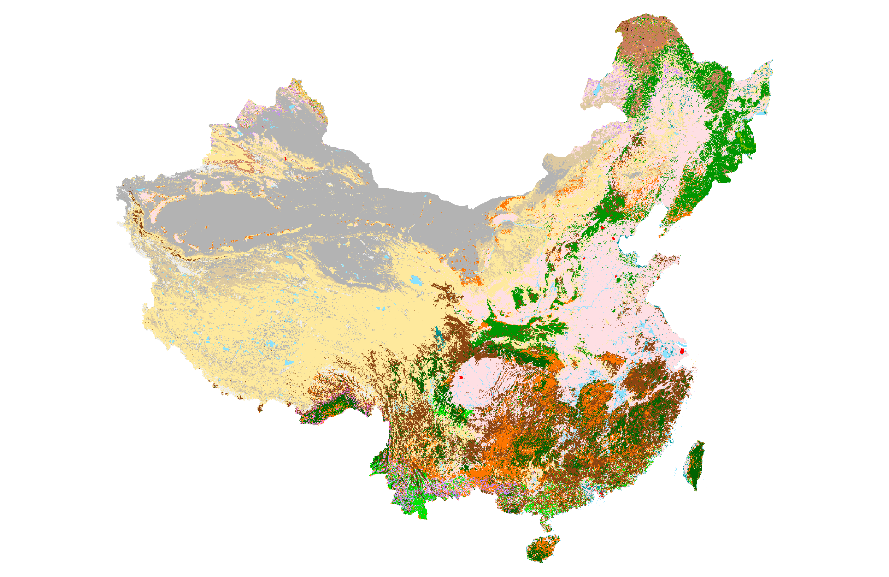

<a name="page_top"/>  

**Page Navigation** 
|     |    |    |
| --- | ---| ---|
|  [1. Machine Learning](#MachineLearning) |  [2. Computer Vision](#ComputerVision)|  [3. Cloud Computing](#CloudComputing) 
|  [4. Image Processing](#ImageProcessing) |  [5. Geospatial Applications](#GeospatialApp)  |  [6. Drone/UAV sensing](#Drone) 

<a name="MachineLearning"/>  

## Machine learning

  
 
### 1. MODISNN: a dense neural network

Satellite sensors have a liefspan and different configurations. How can we use machine learning to build a consistent product among multiple sensors and create a >20 years time-series dataset for climate change studies?

<table border="0">
 <tr>
  <td>
     Figure 1. The illustration of using nerual network to fill satellite observation gap in 2012-2015 (red)
    
  </td>
  <td>
     Figure 2. An example of NN model performance at image level (left 2 columns: reference; right 2 columns: nerual network training result)
    
  </td>
 </tr>
</table>

    

[View GitHub Project](https://github.com/chqzeng/MODISNN)  |  [View Publication](https://www.mdpi.com/2072-4292/13/17/3349#)  

<!-- unused: https://pub.mdpi-res.com/remotesensing/remotesensing-13-03349/article_deploy/html/images/remotesensing-13-03349-ag.png?1630051208  the image from publication -->

 <a name="AlgaeDriver"/>  
 
### 2. AlgaeDriver: assess input features' importance to the output variable  
Use continuous geographic, hydrological, climate, and meteorological datasets as input to train neural network(NN) and random forest(RF) models, to determine the major environmentl drivers of algae growth in lakes.  
Use Google Cloud Platform (GCP) to extract relative data from its [Earth Engine Dataset](https://developers.google.com/earth-engine/datasets) and run further NN models    
Figure 1. The illustration of machine learning model input and output varialbes   
   
[View code partially on Github](materials/AlgaeDrive.ipynb)  

     

### 3. Coursera Course: "Machine Learning"

 View Certificate 
   

  [view on coursera.org](https://www.coursera.org/account/accomplishments/certificate/DL9CTNZK3T6P)  

 
  
    
 
[Back to Top](#page_top)

---
<a name="ComputerVision"/>  

## Computer Vision

  

### 1. Detect urban objects from high-resolution imagery (2014 work)  

#### A) River detection from optical and SAR imagery
Integrated Optical and radar imagery are combined for unsuprevised image classification and then a decision tree to refine the result with unique attributes to sense water.
<table border="0">
 <tr>
  <td>
     Figure 1. An illustration of detection of the Bow River at Calgary, Aberta, CA.  
     (a) input optical (WV-2) image, (b) SAR (RadarSat-2) of the study site, (c) object-based unsupervised classification (b) extracted water mask, (e) optical and SAR combined river channel detection.  
    
  </td>
  <td>
     Figure 2. An illustration to connect river channel segments and build a topologically-correct river 
     
  </td>
 </tr>
</table>  

[View project code on Github](https://github.com/chqzeng/NRBC)

#### B) Building detection from aerial photo and LiDAR point clouds (2010 work)
From a high resolution (<1m) satellite imagery or aerial photo, detect buildings of varied conditions.

<table border="0">
 <tr>
  <td>
    Figure 1. An illustration of urban building detection from aerial photos and LiDAR point clouds    
    
  </td>
  <td>
     Figure 2. The reconstructed 3D buildings and trees     
     
  </td>
 </tr>
</table>  

[Ph.D Dissertation](https://ir.lib.uwo.ca/etd/2076/): "Automated Building Information Extraction and Evaluation from High-resolution Remotely Sensed Data" 

    

#### C) Esitmate image depth and 3D model from mutli-view imagery (2015 work)
<table border="0">
 <tr>
  <td>
     Figure 1. An illustration of image matching using edges as constrains    
    
  </td>
  <td>
     Figure 2. How intensity and edge match can improve the stero matching reliability      
     
  </td>
 </tr>
</table>  

[Code in IDL / Matlab](materials/Image_matching.zip)  |  [Journal Paper](https://www.tandfonline.com/doi/abs/10.5589/m13-039)  |  [Book Chapter](https://www.taylorfrancis.com/chapters/edit/10.1201/9780429470196-5/multiview-image-matching-3d-earth-surface-reconstruction-chuiqing-zeng-jinfei-wang)

#### D) Seamless image/video systhesis (2008 work)
seamless synthesis is the process of generate a larger image / longer video based on small images/videos with textures, including single image texture synthesis (2-D), multi-image interactive synthesis(2-D) and video synthesis (3-D).   The main idea was to minimize the energy function at the connection when synthesizing multiple images/frames together.
<table border="0">
 <tr>
  <td width="400">
     An example of single image texture synthesis to create a larger image    
    
  </td>
  <td width="400">
     An example of multi-image interactive synthesis      
     
  </td> 
  <td width="400">
     Another example of multi-image interactive synthesis      
     
  </td>
 </tr>
</table>   

[View C++ codes and files](materials/Image_syn_demo.zip)  

  

   

[Back to Top](#page_top) 

---
<a name="CloudComputing"/>  

## Cloud computing

  

### High perofmrance computering cluster (HPC) 
with the recent [HPC](https://www.canada.ca/en/shared-services/corporate/data-centre-consolidation/high-performance-computing.html) deployed in the Federal Government, I developed and maintain pipeline to process massive data (>100TB) satellite images in real-time. It feeds time-series data to the following Microsoft Azure webportal
 An illustration of HPC structure and major tools used for the data processing pipeline  

### Microsoft Azure 
with an environment mornitoring webportal [EOLakewatch](https://eolakewatch-staging.azurewebsites.net/) deployed on Azure, I maintain the Blob storage/COG imagery and optimize the PostgreSQL database with billions of records.  
 

 
### CREODIAS / Cloudferro 
use CREODIAS Earth Observation (EO) data portal to access 20+ years time series Earth Observation data and direct process without download using Linux virtual machines (VM).  
 

 
### Google Cloud Platform (GCP) 
collect various meteriological and climate data to study Algae growth in lakes using APIs for massive data download from [GEE](https://developers.google.com/earth-engine/datasets/catalog) and [CDS](https://cds.climate.copernicus.eu/cdsapp#!/search?type=dataset). run the processing with GCP virtual machine and manage data in bucket and postprocess to be ready for further machine learning models.   
more details in above [AlgaeDriver](#AlgaeDriver)

  

    

[Back to Top](#page_top)   

---
<a name="ImageProcessing"/> 

## Image processing

  

To Be Continue
<!-- ### Raster to Vector and topological correction
[A Natural-Rule-Based-Connection (NRBC) Method for River Network Extraction from High-resolution Imagery](http://www.mdpi.com/2072-4292/7/10/14055/html)  
-->

  

    

[Back to Top](#page_top)  

---
<a name="GeospatialApp"/> 

## Geospatial Application  

  
 
### populatoin spatialization
Given an administrative boundary and its total population, how to determine the population spatial distribution within that admin boundary?
[Population spatialization in china based on night-time imagery and land use data](http://www.tandfonline.com/doi/abs/10.1080/01431161.2011.569581)
use [nighttime light](https://ngdc.noaa.gov/eog/download.html) and [land use](https://forobs.jrc.ec.europa.eu/products/glc2000/glc2000.php) dataset to determine the spatial distribution of population.
 
<table border="0">
 <tr>
  <td width="600">
     input data 1: land use land cover   
    
  </td>
  <td width="600">
     input data 2: nighttime light      
     
  </td> 
  </tr>
 
 <tr>
  <td width="600">
     input data 3: population in administrative boundaries      
     
  </td>
   <td width="600">
     output data: population in 1km grids      
     
  </td>
 </tr>
 
</table>   
 

   

        

[view partial codes](materials/Pop_spatialization.zip)

### Vehicle-based POI collection system 
develop a light platform that can collect and update points of interest (POIs) with vehicle top-mounted cameras and GPS-receiver, to update existing POI database and collect street-view map like Google Street View.
<table border="0">
 <tr>
    <td width="600">
      the illustration of the survey platform      
     
  </td> 
     
  <td width="600">
     the survey platform interface with loaded POIs   
    
  </td>
  <td width="600">
     image extracted from vehicle top-mounted camera videos      
     
  </td>
 </tr>
 
</table>  
 
            
 
[view partial codes](materials/Vehicle_based_POI_collection.zip)

  

[Back to Top](#page_top)  

--- 
<a name="Drone"/> 

## Drone/UAV sensing development  

  

### UAV sensing for agriculture application
Raspebery PI as the control unit to connect multiple sensors on board the quad-rotatory drones

 <table border="0">
 <tr>
    <td width="600">
      the illustration of the drone/UAV hardware setup      
     
  </td> 
     
  <td width="600">
     an example of UAV flight planning over water  
    
  </td>
 </tr>
  
 
### UAV sensing for water application
 

  

   

[Back to Top](#page_top)  

<!--  left over

Click Image below to explore EOLakeWatch
  
   

-->
<!-- <iframe src="https://public.tableau.com/views/EOLakeWatchAttentionLacsOTEN/EOLakeWatch-AttentionLacsOT?:toolbar=n&amp;:display_count=y&amp;:origin=viz_share_link?:embed=y&amp;:display_count=yes&amp;:showVizHome=no" width="100%" height="600px"></iframe>
-->
<!--   
[Explore EOLakeWatch](https://eolakewatch-staging.azurewebsites.net/webapp/)   -->
