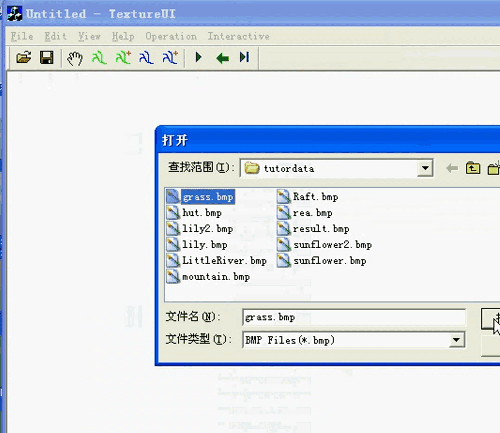
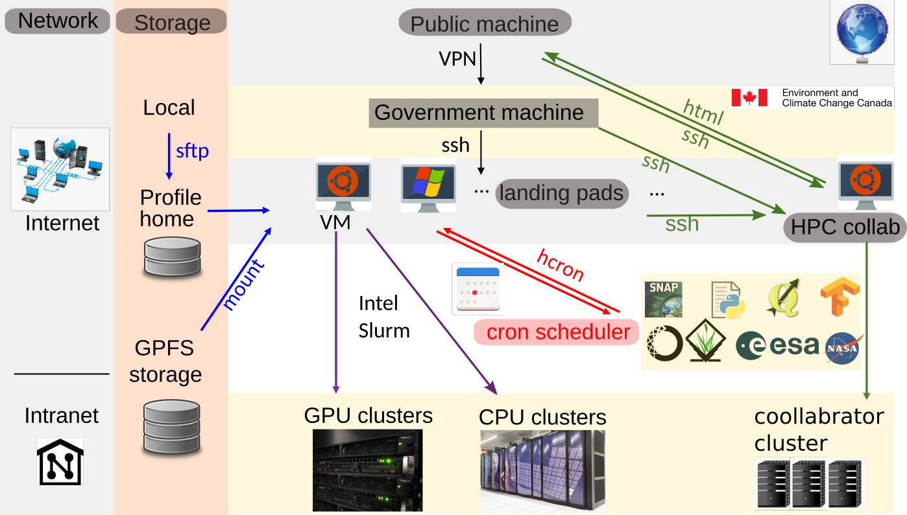

<a name="page_top"/>  

**Page Navigation** 
|     |    |    |
| --- | ---| ---|
|  [1. Machine Learning](#MachineLearning) |  [2. Computer Vision](#ComputerVision)|  [3. Cloud Computing](#CloudComputing) 
|  [4. Image Processing](#ImageProcessing) |  [5. Geospatial Applications](#GeospatialApp)  |  [6. Drone/UAV sensing](#Drone) 

<a name="MachineLearning"/>  

## Machine Learning

  
 
### 1. MODISNN: a dense neural network

Satellite sensors have a liefspan and different configurations. How can we use machine learning to build a consistent product among multiple sensors and create a >20 years time-series dataset for climate change studies?

<table border="0">
 <tr>
  <td>  
      
    Using nerual network to fill satellite observation gap in 2012-2015 (red dash line box)
  </td>
  <td>  
       
     An example of NN model performance at image level   
     left 2 columns: reference image; right 2 columns: nerual network trained result
    
  </td>
 </tr>
</table>

    

[View GitHub Project](https://github.com/chqzeng/MODISNN)  |  [View Publication](https://www.mdpi.com/2072-4292/13/17/3349#)  

<!-- unused: https://pub.mdpi-res.com/remotesensing/remotesensing-13-03349/article_deploy/html/images/remotesensing-13-03349-ag.png?1630051208  the image from publication -->

 <a name="AlgaeDriver"/>  
 
### 2. AlgaeDriver: assess input features' importance to the output variable  
Use continuous geographic, hydrological, climate, and meteorological datasets as inputs to train neural network(NN) and random forest(RF) models and determine the major environmentl drivers of algae growth in lakes.  
Use Google Cloud Platform (GCP) to extract relative data from its [Earth Engine](https://developers.google.com/earth-engine/datasets) Dataset and run further NN models    
 

    
AlgaeDriver machine learning model input and output variables  

[View jupyter code partially on Github](materials/AlgaeDrive.ipynb)  

     

### 3. Coursera Course: "Machine Learning"

 View Certificate 
   

  [view on coursera.org](https://www.coursera.org/account/accomplishments/certificate/DL9CTNZK3T6P)  

  

   
 
[Back to Top](#page_top)

---
<a name="ComputerVision"/>  

## Computer Vision

  

### 1. Detect urban objects from high-resolution imagery  

#### A) Detect rivers from optical and SAR imagery
Exploit the unique attributes of water in optical and radar/SAR images by first integrating both images for unsupervised classification, and then refining the results with a decision tree.  
<table border="0">
 <tr>
  <td>  
     
     Steps to detect the Bow River at Calgary, Aberta, CA.   
     (a) input 2m WV-2 optical image, (b) RadarSat-2 SAR image, (c) object-based unsupervised classification, (d) extracted water mask, (e) river channel detection after optical and SAR combined.  
    
  </td>
  <td>
     
     Connect the river channel segments to build a topologically correct river
  </td>
 </tr>
</table>  

      

[View project code on Github](https://github.com/chqzeng/NRBC)

#### B) Building detection from aerial photos and LiDAR point clouds (2012)
Detect buildings under varied scenarios from high-resolution (<1m) satellite images or aerial photos.

<table border="0">
 <tr>
  <td width="400">
         
    Urban building detection from aerial photos and LiDAR point clouds 
  </td>
  <td width="600">
         
     The reconstructed 3D buildings and trees   
  </td>
 </tr>
</table>  

[Ph.D Dissertation](https://ir.lib.uwo.ca/etd/2076/): "Automated Building Information Extraction and Evaluation from High-resolution Remotely Sensed Data" 

      

#### C) Esitmate image depth and 3D model from mutli-view imagery (2015)
<table border="0">
 <tr>
  <td>  
         
    An example of image matching using edges as constrains 
  </td>
  <td>  
       
      Combined intensity and edge matching improves the stero matching reliability 
  </td>
 </tr>
</table>  

   

[Code in IDL / Matlab](materials/Image_matching.zip)  |   [Journal Paper](https://www.tandfonline.com/doi/abs/10.5589/m13-039)  |  [Book Chapter](https://www.taylorfrancis.com/chapters/edit/10.1201/9780429470196-5/multiview-image-matching-3d-earth-surface-reconstruction-chuiqing-zeng-jinfei-wang)

#### D) Seamless image/video systhesis (2008)
Seamless synthesis is the process of generating a larger image or longer video based on small images with textures or short videos, e.g. single-image texture synthesis (2D), multi-image interactive synthesis (2D), and video synthesis (3D). The main idea is to minimize the energy function at the connection when synthesizing multiple images or frames together.  

<table border="0">
 <tr>
  <td width="400">
        
    An example of single image texture synthesis to create a larger image  
  </td>
  <td width="400">
         
     An example of multi-image interactive synthesis  
  </td> 
  <td width="400">
         
     Another example of multi-image interactive synthesis  
  </td>
 </tr>
</table>   

  
[View C++ codes and files](materials/Image_syn_demo.zip)  

  

   

[Back to Top](#page_top) 

---
<a name="CloudComputing"/>  

## Cloud computing

  

<a name="HPCsection"/> 

### High perofmrance computering (HPC) 
Using the recent [HPC](https://www.canada.ca/en/shared-services/corporate/data-centre-consolidation/high-performance-computing.html) established in the Government of Canada, I developed and maintain pipeline to process >100TB satellite images using massive GPUs and CPUs, which feeds time-series data to the following Microsoft Azure webportal.
 
    
The HPC structure and major tools used for the data processing pipeline   

        

### Microsoft Azure 
with an environment mornitoring webportal [EOLakewatch](https://eolakewatch-staging.azurewebsites.net/) deployed on Azure, I maintain the Blob storage/COG imagery and optimize the PostgreSQL database with billions of records.  
 
  

   
 
### CREODIAS / Cloudferro 
use CREODIAS Earth Observation (EO) data portal to access 20+ years time series Earth Observation data and direct process without download using Linux virtual machines (VM).  
 
  

   
 
### Google Cloud Platform (GCP) 
collect various meteriological and climate data to study Algae growth in lakes using APIs for massive data download from [GEE](https://developers.google.com/earth-engine/datasets/catalog) and [CDS](https://cds.climate.copernicus.eu/cdsapp#!/search?type=dataset). run the processing with GCP virtual machine and manage data in bucket and postprocess to be ready for further machine learning models.   
more details in above [AlgaeDriver](#AlgaeDriver)

  

    

[Back to Top](#page_top)   

---
<a name="ImageProcessing"/> 

## Image processing

 

### Water quality mapping from satellite imagery  
Apply statistical and machine learning models to over 20 years' worth of 100+Tb satellite imagery using [HPC](#HPCsection), develop and maintain an image processing pipeline that generates both an archive of time-series daily lake statistics starting from 2002 and processes data in near real-time on a daily basis. The project is expanding to monitor all major lakes in Canada.  

 

     

[View partial codes](https://github.com/chqzeng/OpenWL) | [View publications](https://www.sciencedirect.com/science/article/pii/S0380133022002660)  

### Image fusion  

Q: With two datasets: one covering spatial details but only having 6 bands(colors), and another measuring sparse points spatially but having >100 bands, how can we estimate a dataset with both rich spatial details and >100 bands?  
A: Use a Bayesian missing data imputation approach to fuse the two dataset.
 
 <table border="0">
 <tr>
    <td width="500">
       
     the illustration of mutlspectral and spectrometer datasets fusion
  </td> 
     <td width="400">
         
     an example of the output hyperspectral dataset   
  </td> 
 </tr>
</table>  

     
 
[See codes in Matlab (Generate_Hyperspectral_Image.m)](materials/ImageFusion_MSI.zip)  | [View publication](https://www.mdpi.com/2072-4292/9/7/696)  
 

  

    

[Back to Top](#page_top)  

---
<a name="GeospatialApp"/> 

## Geospatial Application  

  
 
### populatoin spatialization  
Q: Given an administrative boundary and its total population, how can we determine the spatial distribution of population within that administrative boundary (e.g. in 1km grids)? 
A: Use [nighttime light](https://ngdc.noaa.gov/eog/download.html) and [land use](https://forobs.jrc.ec.europa.eu/products/glc2000/glc2000.php) dataset to determine the spatial distribution of population.
 
<table border="0">
 <tr>
  <td width="600">
       
    input data 1: land use land cover 
  </td>
  <td width="600">
         
     input data 2: nighttime light
  </td> 
  </tr>
 
 <tr>
  <td width="600">
         
     input data 3: population in administrative boundaries 
  </td>
   <td width="600">  
         
     output data: population in 1km grids 
  </td>
 </tr>
 
</table>   
 

   

        

[View partial codes](materials/Pop_spatialization.zip)  |  [View publication](http://www.tandfonline.com/doi/abs/10.1080/01431161.2011.569581)

### Vehicle-based POI collection system 
Develop a lightweight platform that can collect and update points of interest (POIs), with cameras and GPS receivers mounted on vehicle top, to update an existing POI database and collect street-view maps similar to Google Street View.  

<table border="0">
 <tr>
    <td width="600">  
          
     the illustration of the survey platform 
  </td> 
     
  <td width="600">
         
    the survey platform interface with loaded POIs 
  </td>
  <td width="600"> 
          
     image extracted from captured videos 
  </td>
 </tr>
 
</table>  
 
             
 
[view partial codes](materials/Vehicle_based_POI_collection.zip)

  

[Back to Top](#page_top)  

--- 
<a name="Drone"/> 

## Drone/UAV sensing 

  

### UAV sensing over land
Experiment Raspberry Pi as the control unit to connect multiple sensors on board the drones, and post-process multi-view images to generate rich 3D terrain and spectral details.

 <table border="0">
 <tr>
    <td width="600">
        
     The illustration of the drone/UAV hardware setup    
  </td> 
     
  <td width="300">
        
    An example of multi-view drone sensing image matching to generate 3D surface   
  </td>
 </tr>
</table>  

    

[Toolbox on Github](https://github.com/chqzeng/AWM2CSV)  
 
### UAV sensing over water  
Experiment and validate different water optical measurements using the flexible drone platform.  
 
<table border="0">
 <tr>
  <td width="600">
     an example of UAV flight planning over water  
    
  </td>
   
 <td width="600">
     an example of water spectra at different scenarios  
    
  </td>
     
 </tr>
</table>  

 

[View publication](https://www.sciencedirect.com/science/article/abs/pii/S0924271617302666)

  

   

[Back to Top](#page_top)  

<!--  left over

Click Image below to explore EOLakeWatch
  
   

-->
<!-- <iframe src="https://public.tableau.com/views/EOLakeWatchAttentionLacsOTEN/EOLakeWatch-AttentionLacsOT?:toolbar=n&amp;:display_count=y&amp;:origin=viz_share_link?:embed=y&amp;:display_count=yes&amp;:showVizHome=no" width="100%" height="600px"></iframe>
-->
<!--   
[Explore EOLakeWatch](https://eolakewatch-staging.azurewebsites.net/webapp/)   -->
